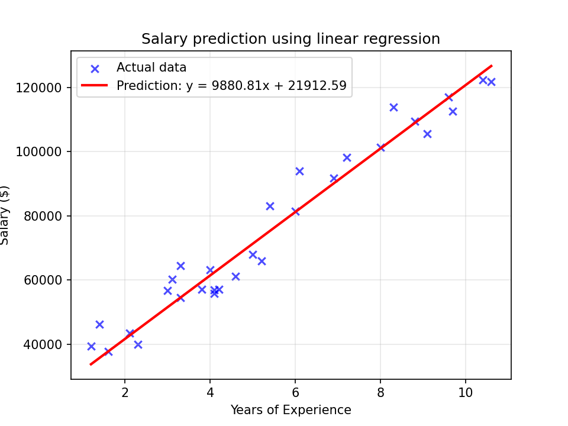
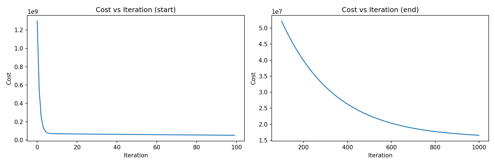
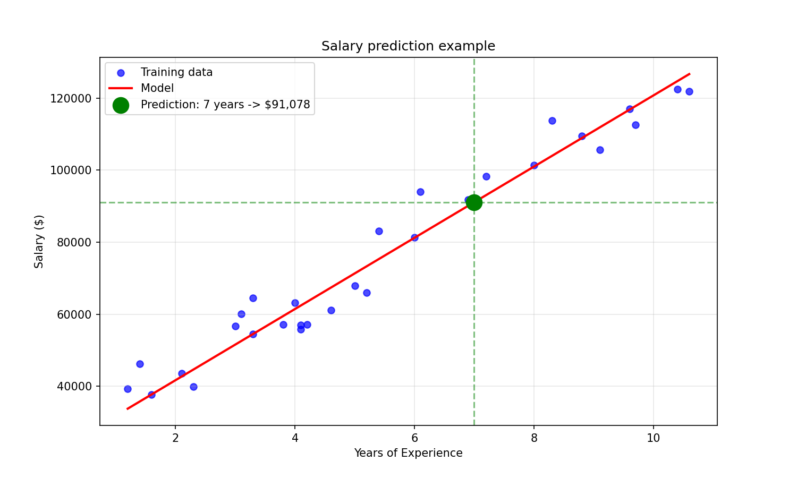

# 💼 Salary Predictor using Linear Regression


Predicting salary based on years of experience using Linear Regression implemented **from scratch** (without sklearn).



## 📌 What This Project Demonstrates

- ✅ Linear Regression from scratch
- ✅ Gradient Descent optimization
- ✅ Cost function implementation
- ✅ Data visualization with Matplotlib

## 📊 Dataset

| Property | Value |
|----------|-------|
| Source | [Kaggle](https://www.kaggle.com/datasets/abhishek14398/salary-dataset-simple-linear-regression) |
| Feature | Years of Experience |
| Target | Salary |
| Samples | 30 |

## 📈 Results

### Model Performance
| Parameter | Value |
|-----------|-------|
| Weight (w) | 9449.96 |
| Bias (b) | 25792.20 |

### Visualizations

<p align="center">
  
</p>

<p align="center">
  
</p>

## 🚀 How to Run

```bash
# Clone the repository
git clone https://github.com/oqaili1/Salary-Predictor.git
cd Salary-Predictor

# Install dependencies
pip install -r requirements.txt

# Run the model
cd src
python model.py

📁 Project Structure

text

Salary-Predictor/
├── data/
│   └── Salary_Data.csv
├── src/
│   ├── model.py
│   └── visualize.py
├── images/
│   ├── cost_plot.png
│   ├── regression_line.png
│   └── prediction_example.png
├── README.md
├── requirements.txt
└── .gitignore

🛠️ Built With

    Python 3.x
    NumPy
    Pandas
    Matplotlib

📚 What I Learned

    Implementing Gradient Descent algorithm
    Understanding cost function optimization
    Data visualization techniques
    Project organization best practices

👤 Author

oqaili1

    GitHub: @oqaili1

📄 License

This project is licensed under the MIT License.